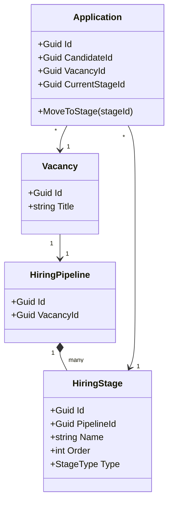

# Архитектура CRM для Рекрутеров (Best Practices)

Этот документ описывает целевое видение микросервисной (или модульно-монолитной) архитектуры для CRM/ATS (Applicant Tracking System), спроектированной по принципам Domain-Driven Design (DDD).

---

## 🏗️ 1. Нарезка доменов (Bounded Contexts / Микросервисы)

Для обеспечения гибкости, масштабируемости и независимости команд, бизнес-логика разделена на следующие сервисы (модули):

1. **`Identity` (IAM)**
   - **Ответственность:** Аутентификация, авторизация, управление пользователями (рекрутерами, админами), ролями и правами доступа (RBAC/ABAC).
2. **`MasterData` (Справочники)**
   - **Ответственность:** Единый источник правды для всех общих справочников системы, чтобы избежать дублирования.
3. **`Customers` (Клиенты и Контракты)**
   - **Ответственность:** Ведение бизнес-заказчиков (особенно если это агентство). Компании, контактные лица (ЛПР), история коммерческих отношений.
4. **`Recruitment` (Управление Вакансиями)**
   - **Ответственность:** Жизненный цикл вакансии как бизнес-заявки. Бюджеты, описания, требования, профиль идеального кандидата, ответственные рекрутеры.
5. **`Candidates` (База Талантов / Talent Pool)**
   - **Ответственность:** Глобальная база всех физических лиц. Резюме, скиллы, опыт работы, контакты, история образования. Профиль кандидата существует независимо от того, нанимают его сейчас или нет.
6. **`ApplicantTracking` (ATS / Воронка Найма)**
   - **Ответственность:** Процесс найма (Pipeline). Связывает Кандидата и Вакансию. Именно здесь живут отклики (`Applications`) и этапы воронки (`Stages`).
7. **`Tasks` (Рабочие задачи по вакансиям)**
   - **Ответственность:** Управление процессными задачами (от тимлида к рекрутеру/сорсеру) в рамках конкретной вакансии. Трекинг выполнения SLA, приоритетов подбора и конкретных поручений по найму.
8. **`Activities` (Напоминания и Коммуникации)**
   - **Ответственность:** Универсальный планировщик рутинных дел (звонки кандидатам, митинги, отправка писем, follow-up напоминания), комментарии и логирование действий для любой сущности.
9. **`BFF Proxy` (Backend-For-Frontend)**
   - **Ответственность:** API Gateway, агрегация микросервисов для Angular, чтобы фронтенд делал 1 удобный REST/GraphQL запрос вместо 10.

---

## 🧩 2. Доменные сущности по сервисам (Детальное описание)

В этом разделе подробно описаны агрегаты (Aggregate Roots) и сущности (Entities) для каждого микросервиса. Предполагается, что большинство агрегатов наследуются от базового класса и имеют `Id`, `CreatedAt`, `UpdatedAt`.

### 1. `MasterData` (Справочники)
Модуль предоставляет общие словари для стандартизации данных и фильтрации.
- **`Skill` / `StackItem`**: Навык или технология.
  - Свойства: `Name` (название, напр. "C#"), `CategoryId` (категория: "Базы данных", "Backend").
- **`Position` / `JobTitle`**: Унифицированная должность (для аналитики зарплат).
  - Свойства: `Name` (напр. "Backend Developer"), `Grade` (Junior, Middle, Senior, Lead).
- **`Location`**: Локация (Город / Страна / Регион).
  - Свойства: `Country`, `City`, `Timezone`.
- **`WorkFormat`**: Формат работы (Office, Remote, Hybrid).
- **`CandidateSource`**: Источник появления профиля (HeadHunter, Habr.Careers, Реферал).
- **`Industry`**: Отрасль/Сфера деятельности компании (FinTech, E-Commerce, MedTech).
  - Свойства: `Name`.

### 2. `Customers` (Клиенты и Контракты)
Организации-заказчики, для которых агентство/департамент ведет подбор.
- **`Customer`**: Компания-Заказчик (Aggregate Root).
  - Свойства: `Name`, `Website`, `IndustryId` (ссылка на MasterData.Industry), `Status` (Lead, Active, Churned), `Description`.
- **`ContactPerson`**: Представитель заказчика (HRD, CEO, Tech Lead на стороне клиента).
  - Свойства: `CustomerId`, `FirstName`, `LastName`, `Email`, `Phone`, `Role`, `IsDecisionMaker`.

### 3. `Recruitment` (Управление Вакансиями)
Бизнес-заявки на подбор персонала и контроль бюджета/требований.
- **`Vacancy`**: Заявка на подбор (Aggregate Root).
  - Свойства: `Title`, `Description`, `CustomerId` (связь с компанией), `PositionId` (ссылка на MasterData), `WorkFormatId`, `LocationId`, `SalaryMin`, `SalaryMax`, `Currency`, `StatusId` (Draft, Active, Paused, Closed, Canceled).
- **`VacancyRequirement`**: Обязательные/желательные навыки для вакансии.
  - Свойства: `VacancyId`, `SkillId` (ссылка на MasterData), `IsMandatory` (обязательно ли), `YearsOfExperience` (требуемый опыт).
- **`VacancyAssignment`**: Кто работает над вакансией.
  - Свойства: `VacancyId`, `RecruiterId` (пользователь Identity), `Role` (LeadRecruiter, Sourcer, AccountManager).

### 4. `Candidates` (База Талантов / Talent Pool)
Изолированная база физических лиц, не привязанная к процессу найма конкретной компании.
- **`Candidate`**: Сводный профиль человека (Aggregate Root).
  - Свойства: `FirstName`, `LastName`, `Email`, `Phone`, `CurrentPosition`, `CurrentCompany`, `ExpectedSalaryMin`, `About`, `LocationId` (ссылка на MasterData).
- **`CandidateSkill`**: Подтвержденные навыки кандидата.
  - Свойства: `CandidateId`, `SkillId` (ссылка на MasterData), `Level` (Junior/Middle/Senior или оценка от 1 до 5).
- **`CandidateExperience`**: Опыт работы (Резюме).
  - Свойства: `CandidateId`, `CompanyName`, `Position`, `StartDate`, `EndDate`, `Description`, `IsCurrentJob`.
- **`CandidateEducation`**: Образование (Университет, Курсы).
- **`ExternalProfile`**: Ссылки на внешние ресурсы.
  - Свойства: `CandidateId`, `Url`, `Provider` (LinkedIn, GitHub, Хабр, Telegram).

### 5. `ApplicantTracking` (ATS / Воронка Найма)
Процесс проведения кандидата по этапам на конкретную вакансию. Сердце рекрутинговой системы.
- **`HiringPipeline`**: Воронка найма для конкретной вакансии (Aggregate Root).
  - Свойства: `VacancyId` (какой вакансии принадлежит воронка), `IsActive`, `Name`.
- **`HiringStage`**: Конкретный этап в рамках воронки (колонка на Канбане).
  - Свойства: `PipelineId`, `Name` (например, "Тестовое задание"), `Order` (сортировка), `StageType` (System, Interview, Offer, Reject), `Color`.
- **`Application`**: Заявка/Отклик (связка Кандидата и Вакансии) (Aggregate Root).
  - Свойства: `CandidateId`, `VacancyId`, `CurrentStageId`, `AppliedAt` (дата отклика), `SourceId` (откуда откликнулся), `RejectReason` (текст), `Score` (общая оценка кандидата).
  - *Поведение*: `MoveToStage(Guid newStageId)` (проверяет переходы и генерирует событие `ApplicationStageChangedEvent` для аналитики воронки).
- **`Interview`**: Запланированное собеседование в рамках отклика.
  - Свойства: `ApplicationId`, `ScheduledAt` (время), `DurationMinutes`, `LocationOrLink` (ссылка на Зум), `InterviewerIds` (кто проводит - из Identity), `Status` (Scheduled, Completed, Canceled), `GeneralFeedback`.

### 6. `Tasks` (Рабочие задачи по вакансиям / Tracker)
Система трекинга SLA и процессных поручений от Нанимающего Менеджера к Рекрутерам (и между ними) в рамках работы над вакансией.
- **`VacancyTask`**: Бизнес-задача по найму (Aggregate Root).
  - Свойства: `VacancyId` (обязательная привязка), `Title` ("Снять заявку с тимлида", "Настроить сорсинг"), `Description`, `Priority` (Low, Normal, High, Critical), `DueDate` (дедлайн), `State` (ToDo, InProgress, Review, Done).
- **`TaskAssignment`**: Назначения (От кого -> Кому).
  - Свойства: `TaskId`, `AssigneeId` (кому назначено - рекрутер/сорсер), `AssignerId` (кто поставил - тимлид).

### 7. `Activities` (Напоминания и Коммуникации)
Универсальный менеджер рутины и хронологии взаимодействия. Не привязан жестко к вакансии.
- **`Activity`**: Звонок, письмо, встреча или пуш-напоминание (Aggregate Root).
  - Свойства: `Title` ("Сделать фоллоу-ап Евгению через полгода", "Выслать оффер"), `Type` (Call, Email, Meeting, Reminder), `ScheduledAt`, `CompletedAt`, `ResultDescription` (результат звонка).
  - *Полиморфные ключи:* `TargetEntityType` (строка/Enum: "Candidate", "Vacancy", "Customer"), `TargetEntityId` (Guid). Это позволяет, например, повесить напоминалку на кандидата, даже если он сейчас не рассматривается ни на одну вакансию.
- **`Comment` / `LogRecord`**: Заметка или лог общения, хроника действий.
  - Свойства: `Text`, `AuthorId`, `Category` (SystemLog, UserNote, CallSummary).
  - *Полиморфные ключи:* `TargetEntityType`, `TargetEntityId` (Крепится к кандидату, компании или отклику).

---

## 🚦 3. Реализация Канбан-доски (Кастомные этапы для Вакансии)

Ты абсолютно правильно отметил: **у каждой вакансии могут быть свои шаги**. В классическом Recruitment/ATS это решается так:

Словарь этапов не лежит где-то глобально. Создается сущность `HiringPipeline` (Воронка), которая строится индивидуально (или по шаблону) под Vacancy.

### Flow (Жизненный цикл):
1. ПМ или Рекрутер создает `Vacancy` в модуле `Recruitment`.
2. Модуль `Recruitment` публикует интеграционное событие `VacancyCreatedEvent(vacancyId, templateId)`.
3. Модуль `ApplicantTracking` ловит событие и создает `HiringPipeline` для этого `VacancyId`.
4. В `HiringPipeline` генерируются стартовые `HiringStage` (например: Неразобранные -> HR скрининг -> Тех. собес -> Оффер -> Отказ).
5. Рекрутер может в любой момент зайти в настройки этой конкретной воронки и добавить новый этап (например, "Проверка СБ"), пересчитав их `Order` (порядок на доске).

### Как Angular рисует Канбан-доску:
Angular **не ходит** во все сервисы. Он обращается к BFF (Crm.Proxy):

`GET /api/vacancies/{id}/board`

**Под капотом BFF делает:**
1. Идет в `ApplicantTracking`: `GET /pipelines/by-vacancy/{id}` -> Получает массив колонок (`Stages`) и массив карточек (`Applications`). В карточках пока только `CandidateId`.
2. Собирает массив всех уникальных `CandidateId` из карточек.
3. Идет в `Candidates` по gRPC или HTTP REST: `POST /candidates/batch` передавая массив ID. Получает имена, фотки, тайтлы кандидатов.
4. Идет в `Activities`: Запрашивает количество невыполненных задач по этим кандидатам по вакансии (чтобы на доске нарисовать бейджик 🔴 "2 просроченные задачи").
5. BFF маппит все это в единую плоскую JSON ViewModel (`KanbanBoardResponse`) и отдает Ангуляру.

Ангуляр получает готовый JSON (колонки, в них карточки со всеми фото, именами и статусами) и просто рендерит их. При Drag-n-Drop карточки, Ангуляр отправляет:
`POST /api/applications/{appId}/move` `{"targetStageId": "uuid"}`.

---

## 🔌 4. Схемы взаимодействия микросервисов (Паттерны)

### 1. Событийно-ориентированная хореография (Integration Events via Message Broker)
Используется для **Eventually Consistency** (Согласованности в конечном счете) и обновления локальных кэшей данных (ACL - Anti-Corruption Layer).
*Пример:*
- Модуль `Candidates` обновляет имя кандидата. Выбрасывает `CandidateUpdatedEvent(CandidateId, NewFirstName, NewLastName)`.
- Если `ApplicantTracking` хранит денормализованные имена кандидатов ради скорости запросов к БД, он слушает это событие и обновляет имя у себя в таблице `Application`.

### 2. Репликация данных (Read-Only ACL)
Используется для кэширования справочников (из `MasterData`) или пользователей (из `Identity`), чтобы делать быстрые JOIN-ы и поисковые индексы локально.
*Пример:*
- Модулам `Candidates` и `Recruitment` нужны справочники `Skill` и `Location` для крутых SQL-фильтров.
- Они создают у себя **Read-Only** сущности `LocalSkill` и `LocalLocation`. Этим модулям запрещено их редактировать.
- Когда в `MasterData` добавляется навык, летит `SkillCreatedIntegrationEvent`. Модули-подписчики ловят его и делают `INSERT` в свои локальные таблицы.
- Теперь `Recruitment` может делать мгновенные JOIN-ы без походов по сети.

### 3. Синхронные запросы внутри Backend (через gRPC или Http Client)
Используется при агрегации в BFF или строгой валидации.
*Пример:*
- При создании `Application` в модуле `ApplicantTracking`, нужно проверить, существует ли такой `CandidateId`. Модуль делает быстрый синхронный запрос в модуль `Candidates`.

### 4. Shared Database (Допустимо только при Модульном Монолите)
Если пока сервисы живут в одном процессе (как у тебя в решениях Crm.*.Api), вы можете использовать единую БД, но с **РАЗНЫМИ СХЕМАМИ** (Schemas).
Например:
- `[identity].[Users]`
- `[hr].[Vacancies]`
- `[ats].[Applications]`

Желтая карточка: **Никогда не делайте JOIN между разными схемами (модулями) в EF Core напрямую.** Если нужен Join, значит это работа для BFF в памяти, либо нужно денормализовать данные.

---

## 🚀 Что сделать в первую очередь?

1. Удали `CandidateApplication` и `CandidateStage` из модуля `Candidates`.
2. Создай новый модуль `Crm.ApplicantTracking` (ATS).
3. Там создай агрегат `Pipeline` и `Application`.
4. Оставь модуль `VacancyTasks` (можно переименовать просто в `Tasks`), развивай его как таск-трекер поручений от Тимлидов к Рекрутерам в рамках вакансии.
5. Создай **новый** отдельный модуль `Crm.Activities` для сквозных напоминалок, звонков и писем (с полиморфизмом `TargetEntityId`, `TargetEntityType`).
6. Делегируй сборку данных для фронта (Канбан доски) в `Crm.Proxy`.
